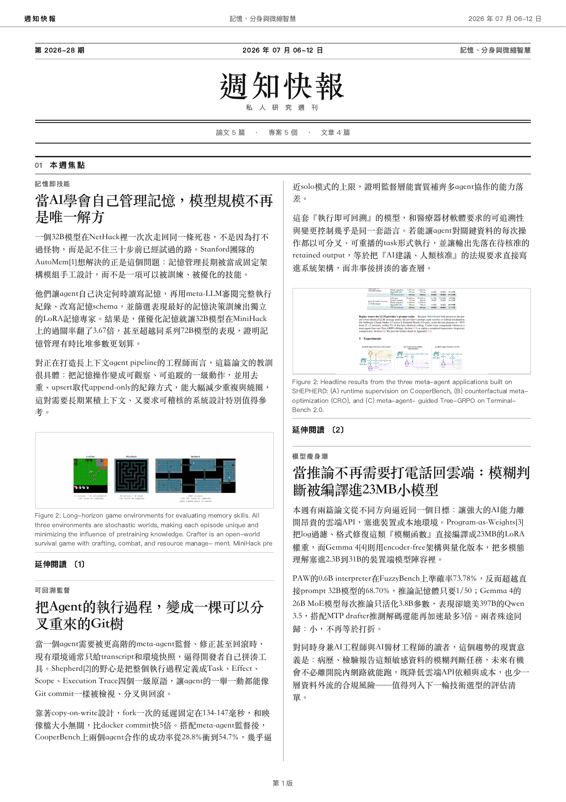
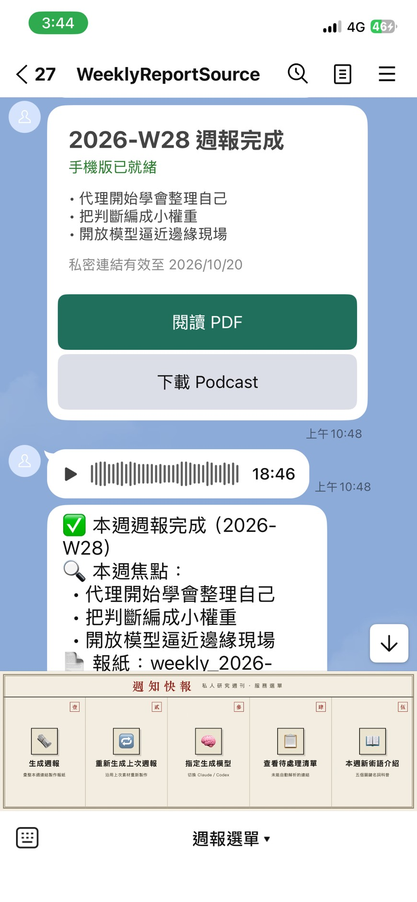

# Link2News

[](https://github.com/Kuanyu458/Link2News/actions/workflows/ci.yml)
[](LICENSE)


> Public beta (`v0.1.0b1`). A single-user, single-trusted-source, self-hosted
> macOS tool; not a ready-made multi-tenant service.

Turn a week of papers, GitHub repositories, news, and social links into a
mobile-friendly newspaper PDF and podcast. Share sources with a LINE bot. When you
request a report, a Mac pipeline resolves the links, creates a cited weekly
digest and optional podcast, then returns private mobile links through LINE.

## See the result

### Newspaper-style report

[](docs/assets/weekly_2026-W28.pdf)

[📄 Open or download the complete five-page `weekly_2026-W28.pdf` demo](docs/assets/weekly_2026-W28.pdf)

### Podcast demo

[🎧 Play or download the ~30-second podcast demo](docs/assets/link2news-podcast-demo.mp3)

> The PDF demo cites public papers and preserves source references. Original
> figures retain their respective licenses; see [third-party notices](THIRD_PARTY_NOTICES.md).
> The podcast demo uses synthetic text and system-generated speech. The
> repository contains no user messages, private reports, or credentials.

Every focus story, featured paper, and academic roundup includes a figure or
table from the corresponding source, with its attribution preserved.

## What it does

- Collects papers, GitHub repositories, news, and social links from LINE.
- Produces a cited Traditional Chinese newspaper-style HTML and A4 PDF.
- Optionally generates a podcast and returns private mobile links through LINE.
- Exposes authenticated HTTP endpoints for bookmark, bot, and knowledge-tool integrations.

## How to use

1. Share source URLs with the authorized LINE chat during the week.
2. Use the Rich Menu to generate or regenerate a report, select a model, or inspect pending items.
3. Let the Mac background runner generate the PDF and optional podcast.
4. Open the PDF, download the podcast, or play the audio directly from LINE.

<p align="center">
  
</p>
<p align="center"><sub>LINE delivery example with direct PDF and podcast actions plus Rich Menu controls.</sub></p>

## Usage limits

- Public beta for a self-hosted macOS machine and one trusted LINE user or chat.
- Not a ready-made multi-tenant SaaS; secure and rate-limit the Worker API before exposing it.
- Direct mobile artifact links require Cloudflare R2; local generation still works without it.
- You provide and pay for the LINE, Cloudflare, and LLM accounts.
- Review generated summaries, citations, and audio before external publication or decision use.
- Source text and figures retain their respective licenses; see [third-party notices](THIRD_PARTY_NOTICES.md).

## Install

### Requirements

- macOS and Python 3.10–3.13
- Node.js 20+ and a Cloudflare account with Workers, D1, and R2
- A LINE Messaging API channel
- Claude CLI, Codex CLI, or an Anthropic API key
- Optional `ffmpeg` for podcast processing

### Quick start

```bash
git clone https://github.com/Kuanyu458/Link2News.git
cd Link2News
./scripts/bootstrap.sh
```

Then edit:

- `~/.config/weekly-report/config.yaml`
- `~/.config/weekly-report/secrets.env`

Set `line.push_to` to your `U...` user ID from LINE Developers. Deploy the
Worker with `./collector/deploy.sh`, bind its `/webhook` URL in the LINE
console, then install the background runner with `./launchd/install.sh`.

Validate locally before sending a real request:

```bash
.venv/bin/weekly-report doctor --offline
.venv/bin/weekly-report doctor --live
.venv/bin/weekly-report run --dry-run
```

Architecture, deployment, CLI, operations, and troubleshooting are documented
in [docs/TECHNICAL.md](docs/TECHNICAL.md). Integration endpoints are in
[docs/API.md](docs/API.md), and the data boundary in
[docs/SECURITY_AND_PRIVACY.md](docs/SECURITY_AND_PRIVACY.md).

## License

MIT. Optional dependencies retain their own licenses; see
[THIRD_PARTY_NOTICES.md](THIRD_PARTY_NOTICES.md).
