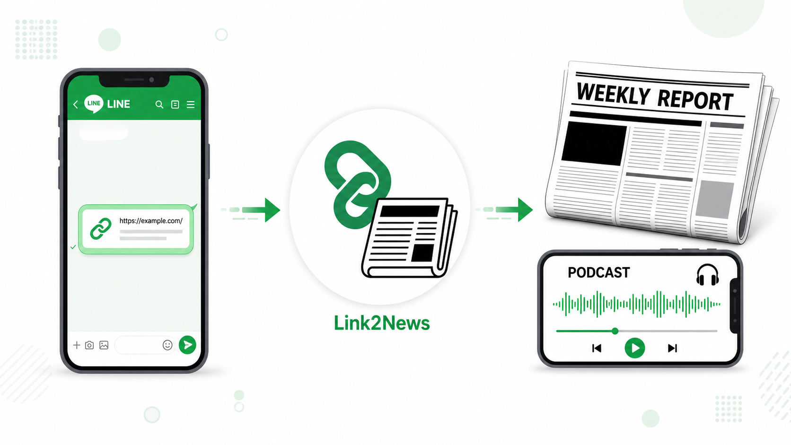
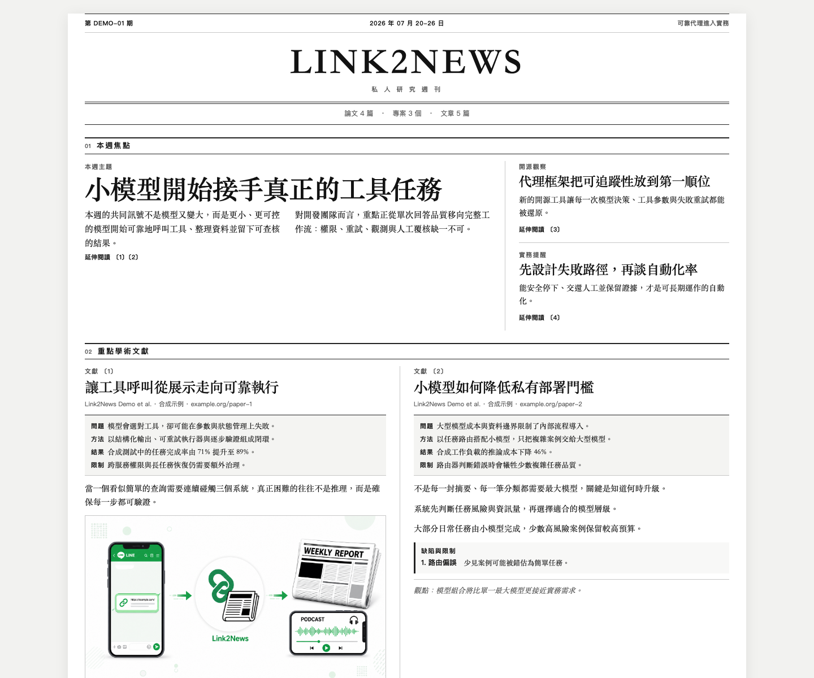

# Link2News

[](https://github.com/Kuanyu458/Link2News/actions/workflows/ci.yml)
[](LICENSE)


> Public beta (`v0.1.0b1`). A single-user, single-trusted-source, self-hosted
> macOS tool; not a ready-made multi-tenant service.

Turn a week of papers, GitHub repositories, news, and social links into a
mobile-friendly newspaper PDF and podcast. Share sources with a LINE bot. When you
request a report, a Mac pipeline resolves the links, creates a cited weekly
digest and optional podcast, then returns private mobile links through LINE.


## See the result



### Newspaper-style report



### Podcast demo

[🎧 Play or download the ~30-second podcast demo](docs/assets/link2news-podcast-demo.mp3)

> Every showcase asset uses synthetic data and system-generated speech. The
> repository contains no user messages, papers, reports, or credentials.

## Requirements

- macOS and Python 3.10–3.13
- Node.js 20+ and a Cloudflare account with Workers, D1, and R2
- A LINE Messaging API channel
- Claude CLI, Codex CLI, or an Anthropic API key
- Optional `ffmpeg` for podcast processing

## Quick start

```bash
git clone https://github.com/Kuanyu458/Link2News.git
cd Link2News
./scripts/bootstrap.sh
```

Then edit:

- `~/.config/weekly-report/config.yaml`
- `~/.config/weekly-report/secrets.env`

Set `line.push_to` to your `U...` user ID from LINE Developers. Deploy the
Worker with `./collector/deploy.sh`, bind its `/webhook` URL in the LINE
console, then install the background runner with `./launchd/install.sh`.

Validate locally before sending a real request:

```bash
.venv/bin/weekly-report doctor --offline
.venv/bin/weekly-report doctor --live
.venv/bin/weekly-report run --dry-run
```

Architecture, deployment, CLI, operations, and troubleshooting are documented
in [docs/TECHNICAL.md](docs/TECHNICAL.md). Integration endpoints are in
[docs/API.md](docs/API.md), and the data boundary in
[docs/SECURITY_AND_PRIVACY.md](docs/SECURITY_AND_PRIVACY.md).

## License

MIT. Optional dependencies retain their own licenses; see
[THIRD_PARTY_NOTICES.md](THIRD_PARTY_NOTICES.md).
