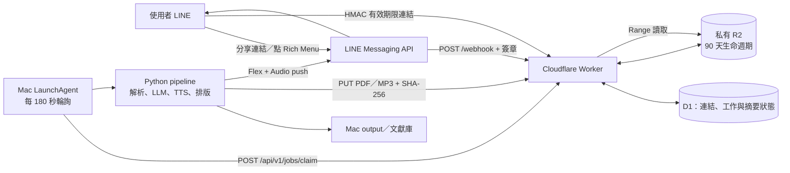
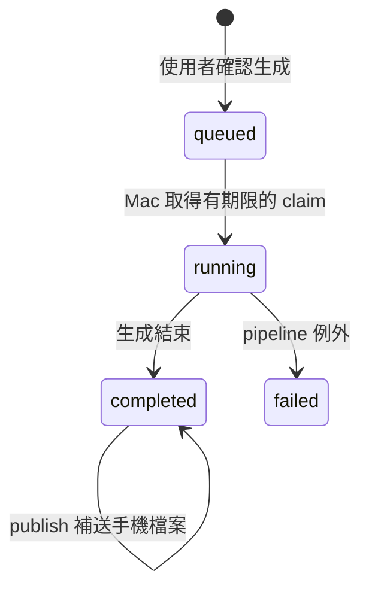

# LINE AI 週報生成系統

[English](README.en.md) · [API 文件](docs/API.md) · [安全與隱私](docs/SECURITY_AND_PRIVACY.md) · [貢獻指南](CONTRIBUTING.md)

> **公開測試版（v0.1.0b1）**：目前支援 macOS 單機自架，並需要使用者自己的 LINE、Cloudflare 與 LLM 帳號。倉庫不包含任何實際訊息、報告、文獻、token、D1/R2 ID 或個人設定；請由範本建立本機設定。

這是一套以 LINE 作為操作入口、Cloudflare 作為佇列與檔案中繼、Mac 作為生成主機的個人週報系統。使用者平日只要把論文、GitHub、新聞或社群貼文分享到 LINE；需要週報時按下 Rich Menu，Mac 會自動收集、解析、撰寫、排版並產生 Podcast，完成後把可在手機直接閱讀的 PDF 與音訊送回 LINE。

> 目前是 macOS 單機版。Cloudflare Worker 持續在線，但 LLM、PDF 與 Podcast 都由已登入使用者帳號的 Mac 執行；Mac 關機或登出時，工作會保留在 `queued`，下次開機登入後再接手。

## 使用者會得到什麼

- LINE 五鍵選單：生成週報、重新生成上次週報、指定生成模型、查看待處理清單、本週新術語介紹。
- A4 直向雙欄 PDF：`weekly_YYYY-Www.pdf`。
- 約 15 分鐘雙人訪談式 Podcast：`podcast.mp3`。
- 名詞說明、文獻摘要、GitHub 導入發想等 Markdown 中間產物。
- 論文 PDF、引用編號、圖表擷取與週次文獻庫。
- 可查詢的排隊、執行階段、處理進度、完成或失敗狀態。
- 私有 R2 手機閱讀連結；PDF 可直接開啟，Podcast 可在 LINE 播放或下載。

## 系統架構



各元件的責任如下：

| 元件 | 責任 | 主要資料 |
|---|---|---|
| LINE Official Account | 接收連結、按鈕指令與發送完成通知 | 訊息、Rich Menu |
| Cloudflare Worker | 驗證 LINE webhook、保存佇列與狀態、簽發私密媒體網址 | `collector/worker.js` |
| Cloudflare D1 | 保存原始連結、術語選擇、工作與快照狀態 | `links`、`term_selections`、`state` |
| Cloudflare R2 | 保存手機閱讀用 PDF／MP3 | `reports/<week>/...` |
| macOS LaunchAgent | 每 3 分鐘檢查待執行工作 | `com.weekly.trigger` |
| Python pipeline | 連結解析、內容擷取、LLM 生成、TTS、PDF 與上傳 | `pipeline/` |

## 完整流程與判斷邏輯

### 1. 收件與建立工作

1. LINE 把文字事件送到 `POST /webhook`；Worker 先用 `LINE_CHANNEL_SECRET` 驗證 `x-line-signature`，失敗回 `403`，不處理內容。
2. 一則訊息可包含多個網址，每個網址先寫入 D1；生成時再以正規化網址去重。
3. 按「生成週報」時：
   - 已有 `queued` 或未放棄的 `running` 工作：不重複排入，直接顯示目前進度。
   - 本週連結為 0：提示先分享連結，不建立工作。
   - 有連結：顯示連結數與模型，使用者再次確認才建立 `queued` 工作。
4. `running` 工作若超過 6 小時沒有更新，下一次要求可視為已放棄並建立新工作；狀態頁在 10 分鐘沒有 heartbeat 時就先顯示停滯警告。
5. 「重新生成上次週報」只在沒有執行中工作、且 Worker 有上次 `snapshot.week` 時可用；它沿用既有 `ingested.json` 與引用資料，不重新讀取 LINE。

### 2. Mac 接手與狀態機



- LaunchAgent 每 180 秒執行 `pipeline/check_trigger.sh`。
- 每次輪詢都更新 `mac_last_poll`；排隊畫面超過 6 小時沒看到輪詢時，會提示 Mac 可能離線。
- Mac 先取得五分鐘 claim lease，再於第一個 heartbeat 確認已真正啟動；若程序在啟動前中斷，工作仍可被安全重取。Mac 端檔案鎖避免手動與排程流程重複執行。
- pipeline 每個主要階段會呼叫 `/job-status`，並每 120 秒送 heartbeat。
- `output/.pipeline.lock` 使用非阻塞檔案鎖，排程與手動執行同時啟動時只允許一個流程繼續。

### 3. URL 分類與解析

所有網址先移除常見追蹤參數與尾端標點，再做 canonicalization：arXiv 的 PDF／HTML 與 Hugging Face Papers 會收斂到 arXiv `abs`；GitHub 深層網址會收斂到 repo 首頁。

| 判斷結果 | 辨識方式 | 後續處理 |
|---|---|---|
| `paper` | arXiv、DOI 或已知學術網站 | 抓 metadata；arXiv 另下載 PDF、抽文字與最多 6 個圖表區域 |
| `github` | 有效的 `github.com/<owner>/<repo>` | GitHub API 抓 repo、README、stars、language、topics；有 token 時完成後自動 star |
| `social` | `config.yaml` 的 `social_domains` | 展開貼文，從主文與有限熱門留言尋找論文／GitHub |
| `news` | 其他一般網頁 | Trafilatura 擷取標題與正文 |

社群貼文的決策順序：

1. 先解開短網址與 Facebook／Threads／Instagram／Google 等轉址包裝。
2. X 使用 FxTwitter、Reddit 使用 JSON、Hacker News 使用 Algolia；Threads、Facebook、Instagram、LinkedIn 等登入牆平台改用 headless Chromium。
3. 每篇貼文預設最多收 3 個實質資源，只讀可取得的前 5 則熱門留言，跨社群平台最多遞迴 2 層。
4. 沒挖到資源但有貼文文字時，讓 LLM 判斷是否明確提及論文標題，再查 arXiv。
5. 仍無論文／GitHub但有正文：保留為一般文章；完全無法展開：進 `unresolved`，可從 LINE 的「查看待處理清單」檢查。

### 4. 生成與交付

完整生成依序執行：

1. 文獻策展、引用數查詢與週次文獻庫整理。
2. 從本週候選詞中排除已解釋術語，自動選 5 個新術語。
3. 生成名詞說明、文獻摘要、GitHub 導入發想。
4. 有 GitHub token 時 star 本週 repo。
5. 有學術文獻時產生訪談腳本與 Podcast；OpenVoice 失敗會退回 Edge TTS，沒有文獻則略過 Podcast。
6. 生成自適應 HTML，再以 Chromium 列印 A4 PDF。
7. PDF／MP3 以 SHA-256 驗證後上傳，單檔上限 50 MB，每檔最多重試 3 次。
8. Worker 回傳 90 天有效的 HMAC 簽章網址；媒體端點支援 `GET`、`HEAD` 與 byte Range，方便手機串流。
9. LINE 收到 Flex 卡片、PDF 按鈕、Podcast 按鈕與可用時的原生音訊訊息。若 Flex 發送失敗，改送純文字網址。

生成成功但上傳或 LINE 交付失敗時，本機產物不會刪除，工作標記為 `completed + deliveryStatus=failed`；可用 `--publish` 補送，不必重跑 LLM、TTS 或排版。

## 安裝前準備

建議使用一台長期登入的 Mac。需要：

- macOS、Python 3.10 以上（目前驗證環境為 Python 3.13）。
- Node.js 與 npm，用來安裝 Cloudflare Wrangler。
- Cloudflare 帳號，並先在 Dashboard 啟用 R2 Object Storage。
- LINE Official Account 與啟用後的 Messaging API channel。
- Claude Code CLI、Codex CLI 或 Anthropic API 三選一；CLI 模式必須先完成互動登入。
- `ffmpeg` 建議安裝，Podcast 合併與 LINE 音訊長度偵測會較可靠。
- GitHub personal access token 為選配；缺少時只略過自動 star。

## 從零串接與安裝

以下指令都從專案根目錄執行：

```bash
cd "/path/to/週報生成專案"
```

### 步驟 1：執行本機 bootstrap

```bash
./scripts/bootstrap.sh
```

此腳本會依含 SHA-256 的 lockfile 建立 `.venv`、安裝本機 Wrangler 與 Chromium，並將公開範本複製到 `~/.config/weekly-report/config.yaml`、`secrets.env` 及未追蹤的 `collector/wrangler.toml`。既有檔案不會被覆寫。

建議另外安裝 `ffmpeg`：

```bash
brew install ffmpeg
```

### 步驟 2：建立本機 secrets

密鑰固定放在使用者設定目錄，不寫進專案：

```bash
mkdir -p "$HOME/.config/weekly-report"
cp secrets.env.example "$HOME/.config/weekly-report/secrets.env"
chmod 600 "$HOME/.config/weekly-report/secrets.env"
openssl rand -hex 32
```

編輯 `~/.config/weekly-report/secrets.env`：

```dotenv
LINE_CHANNEL_ACCESS_TOKEN=LINE_Messaging_API_channel_access_token
COLLECTOR_API_SECRET=剛才產生的長隨機字串
GITHUB_TOKEN=選填
ANTHROPIC_API_KEY=只有_llm.backend_api_時才需要
```

`COLLECTOR_API_SECRET` 必須和 Worker 的 `API_SECRET` 完全相同。不要把 `secrets.env`、Channel secret、access token 或簽章 secret 提交到版本控制。

### 步驟 3：建立 LINE Messaging API channel

LINE 現行流程是先建立 LINE Official Account，再從 Official Account Manager 啟用 Messaging API；不能再直接從 Developers Console 建立 Messaging API channel。

1. 建立 LINE Official Account，進入 LINE Official Account Manager 啟用 Messaging API，並選擇正確的 Provider。
2. 在 LINE Developers Console 開啟該 channel：
   - `Basic settings` 複製 **Channel secret**。
   - `Messaging API` 發行 **Channel access token**，填入本機 `secrets.env`。
   - 需要群組使用時啟用 `Allow bot to join group chats`。
3. 在 Official Account Manager 的回應設定中啟用 Webhook；為避免雙重回覆，關閉不需要的自動回應。
4. 加 bot 為好友；若要在群組收集連結，再邀請 bot 進群組。

### 步驟 4：部署 Cloudflare Worker、D1 與 R2

```bash
npx wrangler login
./collector/deploy.sh
```

部署腳本會建立或重用 D1、套用版本化 migration、建立私有 R2 bucket、設定 lifecycle 與四個必要 secrets、部署 Worker，最後把 URL 寫回使用者設定。

貼上與本機 `LINE_CHANNEL_ACCESS_TOKEN` 相同的值。檢查四個必要 Worker secrets：

```bash
cd collector
npx wrangler secret list
cd ..
```

應包含 `API_SECRET`、`LINE_CHANNEL_SECRET`、`ARTIFACT_SIGNING_SECRET`、`LINE_CHANNEL_ACCESS_TOKEN`。

若 `collector/wrangler.toml` 來自另一個 Cloudflare 帳號，先把 `database_id` 改回 `REPLACE_WITH_YOUR_D1_DATABASE_ID`，再執行部署腳本建立自己的 D1；不要沿用別人的 database ID。

### 步驟 5：綁定 LINE Webhook

部署完成後，在 LINE Developers Console 的 Messaging API 頁設定：

```text
https://weekly-report-collector.<你的 workers.dev 子網域>/webhook
```

按 `Verify` 確認成功、開啟 `Use webhook`；建議同時開啟 webhook redelivery。Worker 會自行驗證 LINE 簽章。

### 步驟 6：取得 LINE 推送目標

先在要使用的 LINE 私聊、群組或聊天室傳一則含網址的文字，再執行：

```bash
./collector/get_push_id.sh
```

腳本會把最新訊息的 `source_id` 寫入 `~/.config/weekly-report/config.yaml` 的 `line.push_to`。部署時同一 ID 也會成為 Worker 的來源 allowlist；其他聊天室事件會被忽略。ID 類型為：使用者 `U...`、群組 `C...`、多人聊天室 `R...`。

### 步驟 7：設定並登入 LLM

編輯 `~/.config/weekly-report/config.yaml` 的 `llm.backend`：

| backend | 認證 | 主要設定 |
|---|---|---|
| `claude-cli` | 在終端機開啟 `claude` 並完成登入 | `claude_model` |
| `codex-cli` | 在終端機開啟 `codex` 並完成登入 | `codex_path`、`codex_model` |
| `api` | `secrets.env` 的 `ANTHROPIC_API_KEY` | `claude_model` |

換電腦時務必把 `codex_path` 改成新機器實際的可執行檔；可用下列指令查找：

```bash
command -v claude
command -v codex
```

LINE 的「指定生成模型」會覆寫單次工作使用的 backend 與模型，但對應 CLI 仍須已安裝、登入且可從背景 runtime 的 PATH 找到。

### 步驟 8：調整個人化設定

至少檢查 `~/.config/weekly-report/config.yaml`：

```yaml
collector:
  base_url: "https://weekly-report-collector.<你的子網域>.workers.dev"

line:
  push_to: "U或C或R開頭的LINE目標ID"

report:
  title: "週知快報"

project_context: "你的角色、專案與閱讀關注點"
```

其他常調參數：

| 設定 | 預設行為 |
|---|---|
| `podcast.target_minutes` | 目標 15 分鐘 |
| `podcast.tts_backend` | `edge`；可改 `openvoice` |
| `resolve.max_depth` | 社群遞迴最多 2 層 |
| `resolve.per_post_cap` | 每篇社群貼文最多 3 個資源 |
| `resolve.social_comment_limit` | 有可靠排序時最多讀 5 則熱門留言 |

### 步驟 9：執行健檢

```bash
.venv/bin/weekly-report doctor --live
```

可先用 `weekly-report doctor --offline` 做不連網、不呼叫付費模型的檢查，再以 `--live` 驗證服務。必要項目應全部為 `✅`。

### 步驟 10：安裝 macOS 背景輪詢

安裝腳本會自動解析目前的 Python、Claude、Codex 與 ffmpeg 路徑：

```bash
./launchd/install.sh
```

腳本會把程式、模板與依 lockfile 重建的 runtime 安裝到：

```text
~/Library/Application Support/WeeklyReport
```

這樣可避開 macOS 對 Desktop／Documents 的背景存取限制。解除排程可執行 `./launchd/uninstall.sh`；預設保留 runtime 與產物，只有明確傳入 `--purge-runtime` 才會移除 runtime。

### 步驟 11：安裝 LINE Rich Menu

```bash
.venv/bin/python scripts/setup_richmenu.py
```

腳本會先建立並設為預設選單，成功後才刪除舊的同名選單；重跑不會讓使用者在部署中途失去選單。

## 第一次端到端驗收

依序做以下檢查：

1. 往 LINE 傳一個本週未傳過的網址。
2. 執行 `./collector/get_push_id.sh`，確認能讀到資料且 `push_to` 正確。
3. 執行 `.venv/bin/weekly-report doctor --live`，必要項目全過。
4. 在 LINE 按「生成週報」；應先看到連結數與模型確認，而不是直接生成。
5. 確認後應先進入排隊，最多約 3 分鐘收到 Mac 開始通知。
6. 再按「生成週報」或傳「查看生成進度」，確認階段與連結進度會更新。
7. 完成後在手機確認：
   - 「閱讀 PDF」可在 LINE 內瀏覽器開啟。
   - Podcast 可播放、拖曳進度或下載。
   - `背景執行產出/YYYY-Www/` 有相同的本機 PDF／MP3。

## 日常使用

1. 一週內持續把網址分享給 bot 所在聊天室；文字中可有多個網址。
2. 需要產出時按「生成週報」並確認。
3. Mac 開機且登入即可；不用保持終端機開啟。
4. 在 LINE 查看進度；完成後直接閱讀 PDF 或播放 Podcast。
5. 若只想換模型或改寫內容，先選模型，再按「重新生成上次週報」。

## 手動指令

```bash
# 預設完整流程：收集 → 生成 → 發布
.venv/bin/weekly-report run

# 只收集／解析／擷取，寫出 ingested.json
.venv/bin/weekly-report collect

# 使用既有 ingested.json 生成
.venv/bin/weekly-report generate --week 2026-W28

# 沿用既有解析與引用資料，重新生成所有報告與媒體
.venv/bin/weekly-report regenerate --week 2026-W28

# 只套用目前版型重排 HTML/PDF，不呼叫模型、TTS、GitHub、LINE 或 R2
.venv/bin/weekly-report rerender --week 2026-W28

# 只補送既有 PDF／Podcast 到 R2 與 LINE
.venv/bin/weekly-report publish --week 2026-W28

# 覆寫單次模型
.venv/bin/weekly-report run --llm codex-cli:gpt-5.6-sol

# 測試流程，不拉真實 LINE、不 push、不發布手機檔案
.venv/bin/weekly-report run --dry-run
```

注意：`--publish` 不支援 `--dry-run`；`--rerender` 需要該週既有的 `ingested.json`、`citations.json` 與 `layout.json`，而且不會自動發布；`--generate` 前必須已有該週 `ingested.json`；同一時間只能有一個 pipeline。

版型採原創黑白大報結構：桌面以主稿加側欄呈現、平板在 `1023px` 以下重組、手機在 `739px` 以下改為單欄且正文維持 `16px`；列印則固定 A4 直式雙欄。修改 `templates/newspaper.html` 後可用下列指令做桌面／手機溢出檢查：

```bash
.venv/bin/python scripts/verify_newspaper_layout.py \
  output/2026-W28/newspaper.html tmp/pdfs/layout-check
```

## 產出目錄

```text
output/YYYY-Www/
├── ingested.json
├── citations.json
├── terms_candidates.json
├── 1_名詞說明報告.md
├── 2_文獻摘要報告.md
├── 4_GitHub導入發想.md
├── podcast_script.json
├── podcast.mp3
├── layout.json
├── newspaper.html
├── weekly_YYYY-Www.pdf
└── assets/

文獻庫/YYYYwwN/
└── [引用編號] 論文標題.pdf
```

背景執行後的權威產物在 `~/Library/Application Support/WeeklyReport/output`；專案內的 `背景執行產出` 是它的捷徑。日誌位於：

```text
~/Library/Application Support/WeeklyReport/output/logs/YYYY-Www.log
~/Library/Application Support/WeeklyReport/output/logs/launchd_trigger.log
```

## 手機檔案安全與保存

- R2 bucket 不公開，使用者只拿到 Worker 簽發的 HMAC URL。
- URL 綁定媒體路徑與到期時間，竄改路徑、到期時間或簽章會回 `403`。
- 目前簽章有效期與 R2 lifecycle 都是 90 天；到期後可在 Mac 用 `--publish --week ...` 產生新網址。
- 上傳需要 `X-Api-Secret`、正確 MIME、`Content-Length` 與 SHA-256；單檔上限 50 MB。
- 手機網址本身在有效期內等同讀取權限，不要轉傳到不受信任的聊天室。
- 本機檔案不受 90 天 R2 lifecycle 影響，會持續保留到使用者自行清理。

## 監控與維護

查看 LaunchAgent：

```bash
launchctl print "gui/$UID/com.weekly.trigger"
tail -f "$HOME/Library/Application Support/WeeklyReport/output/logs/launchd_trigger.log"
```

查看本週 pipeline 日誌：

```bash
tail -f "$HOME/Library/Application Support/WeeklyReport/output/logs/$(date +%G-W%V).log"
```

重新載入程式與環境：

```bash
./launchd/install.sh
launchctl kickstart -k "gui/$UID/com.weekly.trigger"
```

重新部署 Worker：

```bash
cd collector
npx wrangler deploy
cd ..
```

部署前可執行測試：

```bash
.venv/bin/python -m unittest discover -s tests -p 'test_*.py'
npm test
bash -n collector/deploy.sh launchd/install.sh launchd/uninstall.sh pipeline/check_trigger.sh scripts/bootstrap.sh
./scripts/check_public_tree.sh
```

## 疑難排解

| 現象 | 優先判斷 | 檢查與修復 |
|---|---|---|
| LINE 完全沒回應 | Webhook 未啟用、網址錯或簽章 secret 錯 | LINE Console 重新 Verify；`wrangler tail` 看 `POST /webhook`；確認 `LINE_CHANNEL_SECRET` |
| Bot 收得到連結但不能回覆按鈕 | Worker 缺 access token | `cd collector && wrangler secret put LINE_CHANNEL_ACCESS_TOKEN` 後再測 |
| 顯示「已排隊」但一直不開始 | Mac 關機／未登入、LaunchAgent 未載入、背景 runtime 權限或 PATH | 看 `launchctl print` 與 `launchd_trigger.log`；重跑 `./launchd/install.sh` |
| `Operation not permitted` 或 exit 126 | 背景程式直接從 Desktop 執行而受 macOS TCC 阻擋 | 確認 plist 指向 `~/Library/Application Support/WeeklyReport`，不要改回 Desktop |
| Worker 健檢回 `403` | 本機 `COLLECTOR_API_SECRET` 與 Worker `API_SECRET` 不一致 | 重新執行 `wrangler secret put API_SECRET`，貼同一值 |
| 顯示 10 分鐘無更新 | pipeline 卡在網路、LLM、TTS 或 Mac 睡眠 | 查當週 log 的最後階段；喚醒 Mac；必要時終止舊程序後重排工作 |
| LLM 找不到或登入失敗 | CLI 路徑未進 launchd PATH、訂閱帳號尚未登入 | `command -v` 查路徑；互動登入；修改 plist／`codex_path` 後重跑 install |
| PDF 產生失敗 | Chromium 未安裝 | `.venv/bin/python -m playwright install chromium` |
| Podcast 不存在 | 本週沒有學術文獻，或 TTS 全部片段失敗 | 先確認 `ingested.json` 的 `papers`；再查 TTS log |
| OpenVoice 失敗後聲音變了 | OpenVoice 設定或模型不可用，系統已退回 Edge TTS | 檢查四個 `podcast.openvoice` 路徑；重新執行 `scripts/setup_openvoice.sh` |
| 週報完成但手機連結沒有送達 | R2／簽章 secret／LINE push 失敗 | 執行 `--publish --week YYYY-Www`；確認四個 Worker secrets 與 R2 binding |
| 連結顯示 `403` | 簽章已過期或網址被修改 | 用 `--publish` 補送新連結；不要手動修改 query string |
| LINE 推送到錯的聊天室 | `line.push_to` 取到最近測試來源 | 在正確聊天室再傳網址並重跑 `./collector/get_push_id.sh` |
| 修改程式後 LINE 還跑舊版 | launchd 使用獨立 runtime | 重跑 `./launchd/install.sh`，不是只修改專案目錄 |

## OpenVoice 選配

預設 Edge TTS 不需額外設定。若要使用自己或已取得授權的聲音樣本：

```bash
./scripts/setup_openvoice.sh
```

依腳本輸出填入 `podcast.openvoice.python`、`checkpoints_dir`、`reference_host`、`reference_guest`，把 `tts_backend` 改為 `openvoice`，再重跑 `./launchd/install.sh`。請勿使用未經本人同意的聲音樣本。

## 更新、備份與回復

以 Git tag 或 commit 作為程式基線；更新前先保存 `~/.config/weekly-report/`，再執行測試、Worker 部署、`./launchd/install.sh` 與 live doctor。回復時 checkout 上一個已知良好版本、重新部署 Worker 並重跑 installer。不要刪除 runtime 下的 `output` 或文獻庫；installer 與 uninstaller 預設都保留使用者資料。

## 官方串接文件

- [LINE：開始使用 Messaging API](https://developers.line.biz/en/docs/messaging-api/getting-started/)
- [LINE：建立 bot 與設定 Webhook](https://developers.line.biz/en/docs/messaging-api/building-bot/)
- [LINE：接收 Webhook 與驗證簽章](https://developers.line.biz/en/docs/messaging-api/receiving-messages/)
- [LINE：發送 reply／push 訊息](https://developers.line.biz/en/docs/messaging-api/sending-messages/)
- [Cloudflare：Wrangler Worker deploy](https://developers.cloudflare.com/workers/wrangler/commands/workers/)
- [Cloudflare：R2 Workers binding 與 API](https://developers.cloudflare.com/r2/api/workers/workers-api-reference/)
- [Cloudflare：R2 object lifecycle](https://developers.cloudflare.com/r2/buckets/object-lifecycles/)

## 專案文件入口

- `系統運作說明.md`：原始系統行為說明。
- `README.en.md`：英文快速上手。
- `docs/API.md`：外部串接 API、Bearer 認證與錯誤格式。
- `docs/SECURITY_AND_PRIVACY.md`：資料流、信任邊界、保存與刪除方式。
- `CONTRIBUTING.md`：開發、測試與 PR 規範。
- `collector/README.md`：Collector 的精簡部署筆記；新安裝請以本 README 為準。
- `排版原則.md`：報紙版面與內容規則。
- `secrets.env.example`：本機密鑰格式。
- `pipeline/config.example.yaml`：可公開的設定範本；實際設定位於 `~/.config/weekly-report/config.yaml`。
