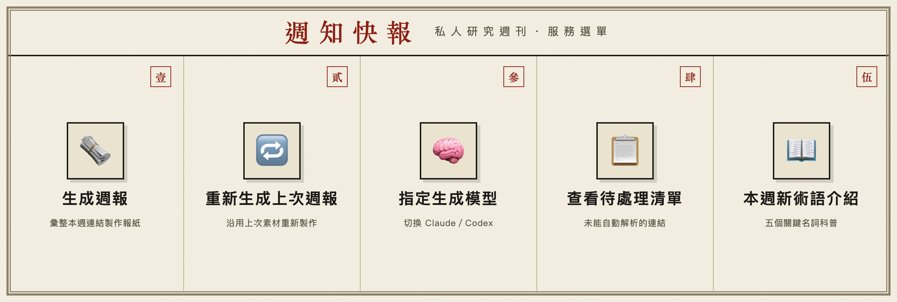

# Link2News

把一週散落在 LINE 裡的論文、GitHub repository、新聞與社群連結，自動整理成可在手機閱讀的新聞式 PDF 與 Podcast。

[](https://github.com/Kuanyu458/Link2News/actions/workflows/ci.yml)
[](LICENSE)


[English](README.en.md) · [安裝與技術文件](docs/TECHNICAL.md) · [HTTP API](docs/API.md) · [安全與隱私](docs/SECURITY_AND_PRIVACY.md)


> 圖中內容全部是合成資料；repository 不包含任何使用者訊息、文獻、報告或憑證。

## 它會做什麼

- **LINE 收件匣**：平日把論文、repository、新聞或社群貼文丟給 bot。
- **AI 編輯台**：自動解析來源、整理引用、選出焦點並產生繁體中文報導。
- **一份真正可讀的週報**：輸出自適應 HTML、A4 PDF、Markdown 報告與選配 Podcast。
- **手機直接交付**：透過私有 Cloudflare R2 簽章連結把 PDF 和音訊送回 LINE。
- **可串接**：以 Bearer token 呼叫 `/api/v1/links` 與 `/api/v1/jobs`，接上自己的書籤、bot 或知識管理工具。

## 安裝

目前需要一台長期登入的 Mac，以及你自己的 LINE Messaging API、Cloudflare Workers/D1/R2 和 Claude CLI、Codex CLI 或 Anthropic API。

```bash
git clone https://github.com/Kuanyu458/Link2News.git
cd Link2News
./scripts/bootstrap.sh
```

接著完成三件事：

1. 編輯 `~/.config/weekly-report/config.yaml` 與 `secrets.env`。
2. 從 LINE Developers 取得自己的 `U...` User ID，填入 `line.push_to`，再執行 `./collector/deploy.sh`。
3. 綁定 Worker `/webhook`、執行健檢，最後安裝背景 runner。

```bash
.venv/bin/weekly-report doctor --live
./launchd/install.sh
.venv/bin/python scripts/setup_richmenu.py
```

完整的帳號設定、部署順序與 macOS 背景服務說明請看 [安裝與技術文件](docs/TECHNICAL.md)。

## 使用方式

把網址分享到 bot 所在的 LINE 私聊或已授權聊天室，再從 Rich Menu 生成週報、切換模型、重新生成或查看待處理項目。



手動執行也很簡單：

```bash
# 完整流程：收集 → 生成 → 發布
.venv/bin/weekly-report run

# 使用既有內容重新套用目前版型，不呼叫 LLM 或 TTS
.venv/bin/weekly-report rerender --week 2026-W28

# 不連外、不寫入產物的預檢
.venv/bin/weekly-report run --dry-run
```

## 目前範圍

Link2News 現在是 `v0.1.0b1` 公開測試版，設計邊界是：

- macOS 單機自架。
- 一個受信任的 LINE 使用者或聊天室來源。
- 使用者自行負責 LLM、LINE 與 Cloudflare 帳號及費用。
- 不是現成的多人 SaaS；不要直接把 Worker API 暴露給不受信任的使用者。

## 文件

| 文件 | 用途 |
|---|---|
| [安裝與技術文件](docs/TECHNICAL.md) | 架構、資料流、部署、CLI、維運與疑難排解 |
| [HTTP API v1](docs/API.md) | 外部工具新增連結、建立與查詢工作 |
| [安全與隱私](docs/SECURITY_AND_PRIVACY.md) | 信任邊界、資料保存、R2 簽章網址與責任範圍 |
| [貢獻指南](CONTRIBUTING.md) | 開發環境、測試與 pull request 規範 |
| [Security Policy](SECURITY.md) | 私下回報安全問題 |

## 開發

```bash
./scripts/bootstrap.sh
.venv/bin/python -m unittest discover -s tests -p 'test_*.py'
npm test
./scripts/check_public_tree.sh
```

README 成果圖可使用合成資料重建：

```bash
.venv/bin/python scripts/generate_readme_preview.py
```

## 授權

[MIT](LICENSE)。選配工具與相依套件保留各自授權，詳見 [THIRD_PARTY_NOTICES.md](THIRD_PARTY_NOTICES.md)。
