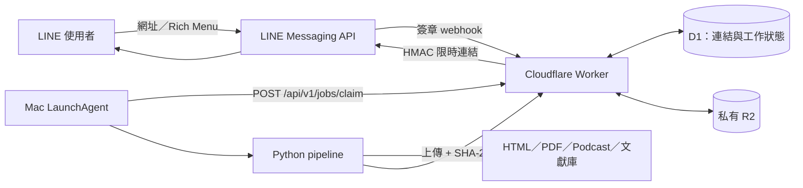
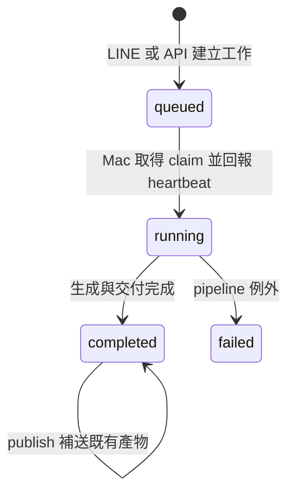

# Link2News 安裝與技術文件

這份文件保存 README 刻意省略的部署、架構、資料流與維運細節。第一次安裝建議依序完成「環境準備 → LINE → 本機設定 → Cloudflare → macOS runner → 端到端驗收」。

## 系統邊界

Link2News 是 macOS 單機、單一信任來源的自架系統：Cloudflare Worker 持續在線，LLM、PDF 與 Podcast 則由登入中的 Mac 執行。Mac 關機或登出時工作保留在佇列，下次上線再接手。

需要：

- macOS 與 Python 3.10-3.13。
- Node.js 20+ 與 npm。
- Cloudflare Workers、D1、R2。
- LINE Official Account 與 Messaging API channel。
- Claude CLI、Codex CLI 或 Anthropic API 三選一。
- 選配 `ffmpeg`；Podcast 合併與時間偵測會更可靠。

## 架構



| 元件 | 責任 |
|---|---|
| LINE | 收集網址、建立工作、顯示狀態與交付結果 |
| Worker | 驗證 webhook、隔離來源、提供 API、簽發媒體網址 |
| D1 | 保存連結、術語選擇、工作與快照狀態 |
| R2 | 私有保存 PDF／MP3，預設 90 天 lifecycle |
| LaunchAgent | 每 180 秒檢查並安全 claim 一個工作 |
| Python pipeline | 解析、策展、LLM、TTS、版型渲染與發布 |

## 工作狀態與可靠領取



Mac 先取得五分鐘 claim lease，第一個 heartbeat 才確認真正啟動。本機 `.pipeline.lock` 會阻止排程和手動流程同時寫入相同產物。

## 處理流程

1. Worker 驗證 LINE `x-line-signature` 與來源 allowlist。
2. 網址正規化並分為 paper、GitHub、social、news。
3. arXiv／DOI 擷取 metadata、全文與圖表；GitHub 讀取 repository metadata；一般網站以 Trafilatura 取正文。
4. pipeline 整理引用、選出五個新術語，生成名詞、文獻與 GitHub 導入報告。
5. 選配產生訪談式 Podcast；OpenVoice 不可用時可退回 Edge TTS。
6. Jinja template 產生自適應 HTML，Chromium 列印 A4 PDF。
7. PDF／MP3 經大小與 SHA-256 驗證後上傳 R2，最後把限時網址推回 LINE。

內容生成和檔案交付是兩個狀態。R2 或 LINE 失敗不會刪除本機成果，可用 `publish` 補送。

## 從零安裝

### 1. Bootstrap

```bash
git clone https://github.com/Kuanyu458/Link2News.git
cd Link2News
./scripts/bootstrap.sh
```

bootstrap 會建立 `.venv`、依 hash lockfile 安裝 Python 套件、安裝本機 Wrangler 與 Chromium，並由範本建立未追蹤設定。既有設定不會被覆寫。

### 2. 本機設定與 secrets

實際設定放在：

```text
~/.config/weekly-report/config.yaml
~/.config/weekly-report/secrets.env
```

最低限度需要：

```dotenv
LINE_CHANNEL_ACCESS_TOKEN=你的_token
COLLECTOR_API_SECRET=長隨機字串
GITHUB_TOKEN=選填
ANTHROPIC_API_KEY=只有_api_backend_需要
```

`config.yaml` 至少確認：

```yaml
collector:
  base_url: "https://weekly-report-collector.YOUR_SUBDOMAIN.workers.dev"
line:
  push_to: "U開頭的LINE使用者ID"
llm:
  backend: "claude-cli"
report:
  title: "LINK2NEWS"
project_context: "你的工作角色與閱讀關注點"
```

一對一使用可在 LINE Developers 的 Basic settings 找到自己的 `U...` User ID。群組 `C...` ID 需從 webhook 事件取得，再同步到 `line.push_to` 與 Worker allowlist。

### 3. LINE channel

1. 建立 LINE Official Account，啟用 Messaging API。
2. 複製 Channel secret，發行 Channel access token。
3. 開啟 webhook；關閉不需要的自動回應。
4. 若需群組使用，開啟允許 bot 加入群組。

### 4. Cloudflare

先在 Dashboard 啟用 R2，並確認 `line.push_to` 已填入信任來源：

```bash
npx wrangler login
./collector/deploy.sh
```

部署腳本會建立或重用 D1、套用 migrations、建立私有 R2 bucket、設定 lifecycle 與必要 secrets，並把 Worker URL 寫回使用者設定。

在 LINE Developers 將 webhook 設為：

```text
https://YOUR_WORKER.workers.dev/webhook
```

### 5. LLM

| backend | 準備方式 |
|---|---|
| `claude-cli` | 安裝 `claude` 並互動登入 |
| `codex-cli` | 安裝 `codex` 並互動登入 |
| `api` | 設定 `ANTHROPIC_API_KEY` 與模型名稱 |

### 6. 健檢與背景 runner

```bash
.venv/bin/weekly-report doctor --offline
.venv/bin/weekly-report doctor --live
./launchd/install.sh
.venv/bin/python scripts/setup_richmenu.py
```

runtime 位於 `~/Library/Application Support/WeeklyReport`，避免 macOS 對 Desktop／Documents 的背景存取限制。專案中的 `背景執行產出` 是 runtime output 的捷徑。

解除排程：

```bash
./launchd/uninstall.sh
```

預設保留 runtime 與產物；只有明確傳入 `--purge-runtime` 才移除 runtime。

## CLI

```bash
weekly-report run
weekly-report collect
weekly-report generate --week 2026-W28
weekly-report regenerate --week 2026-W28
weekly-report rerender --week 2026-W28
weekly-report publish --week 2026-W28
weekly-report doctor --offline
weekly-report doctor --live
```

- `regenerate`：沿用既有解析與引用，重跑報告、Podcast 與排版。
- `rerender`：只讀既有 `layout.json` 與報告，套用目前 template，不呼叫 LLM、TTS、GitHub、LINE 或 R2。
- `publish`：只把既有 PDF／Podcast 補送到 R2 與 LINE。
- `--dry-run`：輸出機器可讀 preflight，不產生外部寫入。

## 產物

```text
output/YYYY-Www/
├── ingested.json
├── citations.json
├── layout.json
├── 1_名詞說明報告.md
├── 2_文獻摘要報告.md
├── 4_GitHub導入發想.md
├── newspaper.html
├── weekly_YYYY-Www.pdf
├── podcast_script.json
├── podcast.mp3
└── assets/
```

## README 展示素材

公開 repository 的週報截圖使用公開文獻與已標示來源的 CC BY 4.0 圖片；Podcast Demo 使用合成文本與系統語音。兩者均可重複產生：

```bash
.venv/bin/python scripts/generate_readme_preview.py
./scripts/generate_podcast_demo.sh
```

Podcast Demo 需要 macOS `say` 與 `ffmpeg`；產出的 MP3 不含真實連結、使用者訊息或私有週報內容。文獻圖片的來源與授權見 [THIRD_PARTY_NOTICES.md](../THIRD_PARTY_NOTICES.md)。

## 監控

```bash
launchctl print "gui/$UID/com.weekly.trigger"
tail -f "$HOME/Library/Application Support/WeeklyReport/output/logs/launchd_trigger.log"
tail -f "$HOME/Library/Application Support/WeeklyReport/output/logs/$(date +%G-W%V).log"
```

每次修改 `pipeline/` 或 `templates/` 後都要重新執行 `./launchd/install.sh`，否則 LINE 背景工作仍會使用舊 runtime。

## 常見問題

| 現象 | 優先檢查 |
|---|---|
| LINE 完全沒回應 | webhook URL、Use webhook、Channel secret、Worker log |
| 已排隊但不開始 | Mac 是否登入、LaunchAgent、`launchd_trigger.log` |
| `Operation not permitted`／exit 126 | plist 是否指向 Application Support runtime |
| Worker `403` | 本機與 Worker 的 API secret 是否一致 |
| LLM 找不到 | CLI 是否登入、路徑是否已同步到 LaunchAgent |
| PDF 失敗 | Playwright Chromium 是否安裝 |
| 手機連結 `403` | 簽章是否過期；使用 `publish` 補送 |
| 改 template 仍是舊版 | 重跑 `./launchd/install.sh` 並比對 runtime template hash |

## 安全與串接

- API 使用 `Authorization: Bearer`；完整格式見 [API 文件](API.md)。
- Worker 僅接受 allowlist 中的 LINE source ID。
- R2 bucket 不公開，媒體網址綁定路徑、到期時間與 HMAC。
- 詳細資料保存、責任邊界與刪除方式見[安全與隱私模型](SECURITY_AND_PRIVACY.md)。
