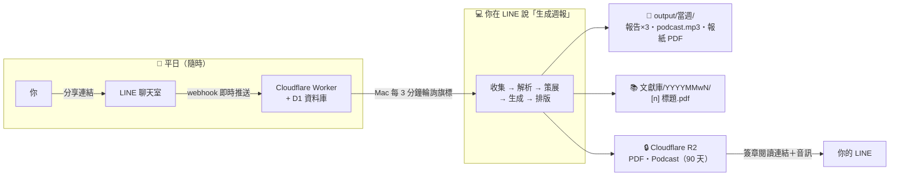
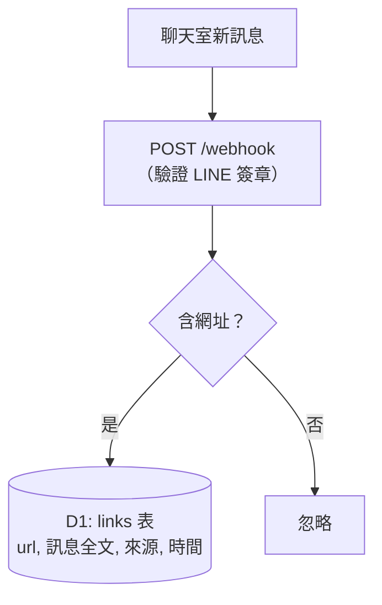
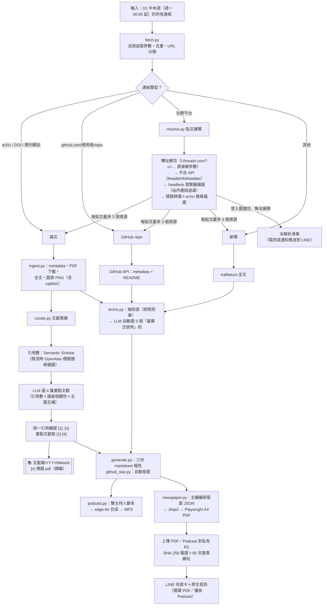
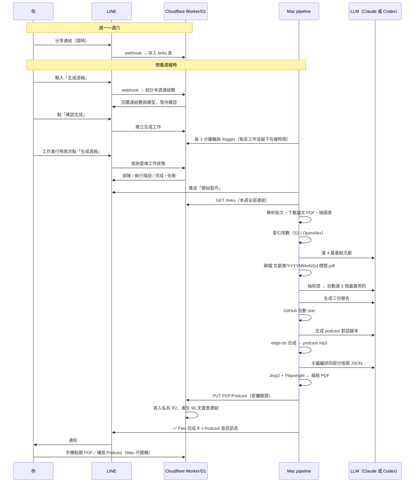

# 週報自動生成系統 — 運作原理與流程說明（v2）

> 對應版本：2026-07-20 v5。安裝與設定步驟見 [README.md](README.md)，本文件說明系統「怎麼運作」。
> v2 變更：單次執行（不再需要 LINE 回覆勾選）、術語自動選 5 個、文獻策展與文獻庫歸檔、
> LLM 可切換 Claude/Codex 訂閱、報紙改為「學術期刊 × New York」四部分版面。

## 1. 系統總覽

你唯一要做的事：**平日照常分享連結到 LINE 聊天室**。其餘全自動。



| 元件 | 位置 | 職責 |
|---|---|---|
| LINE Bot（Messaging API） | LINE 平台 | 在聊天室接收訊息、推送完成/錯誤通知 |
| Cloudflare Worker + D1 | 雲端（免費層） | 24 小時常駐的 webhook 接收端與連結資料庫 |
| Cloudflare R2 | 雲端私有物件儲存 | 保存最終 PDF／Podcast 90 天，Mac 關機後仍可讀取 |
| Pipeline（Python） | 你的 Mac | LINE「生成週報」觸發（launchd 每 3 分鐘輪詢旗標） |
| LLM（可切換） | 你的 Mac | `claude -p`（Claude 訂閱）或 `codex exec`（Codex 訂閱），config.yaml 的 `llm.backend` 切換 |
| TTS（可切換） | 本機/雲端 | edge-tts（預設）或 OpenVoice V2（真人質感，用你本人/已授權的聲音樣本；`podcast.tts_backend` 切換，失敗自動退回 edge） |

## 2. 資料收集層（平日持續運作）



- **輸入**：聊天室裡任何含 `http(s)://` 的訊息
- **輸出**：存入 D1；週日由 Mac 透過 `GET /links?since=<時間>`（帶密鑰）拉取

## 3. 生成流程（LINE 觸發後執行）



## 3.5 完整時序



## 4. 週報版面（v5：A4 學術雙欄＋自適應 HTML）

PDF 版式：**A4 直向、由左至右橫書雙欄**；HTML 在手機改為單欄且不產生橫向捲動。
保留新聞紙底色與紙紋、每頁報眉（刊名｜本期主題｜日期）與「第 N 版」頁碼；
內文明體、標題特黑；文風為科技產業記者報導體，
除專有名詞外不中英夾雜；引用〔n〕與文獻庫 PDF 檔名一致。

| 版面（由左至右、由上至下） | 內容 |
|---|---|
| 報頭 | 刊名橫排、期數日期、本期收錄統計 |
| 壹・本週焦點 | 3 個主題：眉題＋橫式主標＋記者導言，文末「▶ 詳見〔n〕」 |
| 貳・重點學術文獻 | 4 篇：摘要框（問題/方法/結果/缺陷）→ 記者報導 → 原始圖表 → **名詞解釋框（該篇相關術語）** → 缺陷與限制框 → 記者觀點 |
| 參・學術動向 | 一篇總覽短文帶過其餘文獻（附〔n〕） |
| 新詞櫥窗 | 與特定文獻無關的一般術語科普 |
| 參考文獻 | 兩欄排列於閱讀終點，編號同文獻庫 PDF 檔名 |

## 5. 檔案輸入輸出總表

| 檔案 | 產生者 | 用途 |
|---|---|---|
| `output/<週>/ingested.json` | collect | 本週素材主檔（含 ref/featured/citations 欄位） |
| `output/<週>/citations.json` | curate | 引用編號 ↔ 文獻對照表 |
| `文獻庫/<YYYYMMwN>/[n] 標題.pdf` | curate | 論文 PDF 圖書館（逐週累積，編號同報紙引用） |
| `output/<週>/terms_candidates.json` | terms | 術語候選（除錯用） |
| `output/<週>/assets/` | ingest | 論文 PDF 原檔與抽出的圖表 PNG |
| `output/<週>/1_名詞說明報告.md` | generate | 產出 ①（自動選的 5 個術語） |
| `output/<週>/2_文獻摘要報告.md` | generate | 產出 ② |
| `output/<週>/podcast.mp3` | podcast | 產出 ③（腳本存 podcast_script.json） |
| `output/<週>/4_GitHub導入發想.md` | generate | 產出 ④ |
| `output/<週>/weekly_<週>.pdf` | newspaper | 產出 ⑤ 報紙（layout.json / newspaper.html 為中間檔） |
| `R2: reports/<週>/weekly_<週>.pdf` | publish | 手機 PDF，私有簽章讀取、90 天保留 |
| `R2: reports/<週>/podcast.mp3` | publish | LINE 內播與下載來源、支援 Range request |
| `data/known_terms.json` | terms 累積 | 已解釋術語詞庫（未選中的下週仍有機會） |
| `pipeline/config.yaml` | 你（可調整） | LLM backend、刊頭、TTS 聲音、讀者輪廓 project_context |
| `~/.config/weekly-report/secrets.env` | 你（一次性） | LINE token、collector 密鑰、GitHub PAT |

## 6. LLM 訂閱切換

`pipeline/config.yaml`：

```yaml
llm:
  backend: "claude-cli"   # 改 "codex-cli" 即切換到 ChatGPT/Codex 訂閱
  claude_model: "claude-sonnet-5"
  codex_model: ""          # 空 = codex 預設
  codex_search: false      # codex 的網路搜尋（新版 CLI 才支援 --search）
```

切換後跑 `.venv/bin/python pipeline/doctor.py` 會實際發一個測試 prompt 驗證該 backend 可用。

## 7. 手動操作

```bash
.venv/bin/python pipeline/main.py                    # 完整流程
.venv/bin/python pipeline/main.py --collect          # 只收集（除錯）
.venv/bin/python pipeline/main.py --generate         # 只生成（可補跑）
.venv/bin/python pipeline/main.py --generate --week 2026-W28   # 指定週補跑
.venv/bin/python pipeline/main.py --rerender --week 2026-W28   # 只重排既有 HTML/PDF，不發布
.venv/bin/python pipeline/doctor.py                  # 健檢
```

## 8. 設計決策與已知限制

- **為什麼要連結解析？** 你分享的常是社群貼文而非論文本身；系統展開貼文（含留言）挖出 arXiv/GitHub 連結，同一論文的不同形式收斂為一筆，每貼文上限 3 個資源。
- **術語怎麼選？** 每週從素材抽最多 40 個候選、排除已解釋過的，LLM 依「業界廣泛使用程度」自動選 5 個；沒被選中的下週仍可能入選。
- **引用數怎麼來？** Semantic Scholar 優先（免費層常限流），OpenAlex 標題搜尋備援；太新的論文查無記為未知，選文改以相關性判斷。
- LINE Bot 收不到它加入之前的歷史訊息。
- Threads/FB/IG 登入牆使貼文解析非 100%；失敗連結會列在 LINE 完成通知的「待手動處理」清單（完整清單存於 `ingested.json` 的 `unresolved`）。
- edge-tts 偶發限流可能掉少數對話段（5 次退避重試）。
- Mac 未開機時工作會保留在雲端排隊；Mac 開機且已登入後，輪詢間隔 3 分鐘，最多約等 3 分鐘開始。工作期間再次按「生成週報」即可查詢進度。
- PDF／Podcast 生成完成後才會發布到私有 R2；發布失敗不會刪除本機產物，可用 `pipeline/main.py --publish --week <週>` 補送。
- 手機網址是 90 天有效的 bearer link：無須登入，但取得網址的人在期限內可開啟；R2 bucket 本身不公開。
- **LLM 額度用盡時**（例如 Claude 訂閱 session limit）：pipeline 會失敗並推送 LINE 錯誤通知；此時可把 `config.yaml` 的 `llm.backend` 切到另一個訂閱（如 `codex-cli`）後手動補跑 `--generate`，或等額度重置。
- codex CLI 無法在 Claude Code 的沙盒 session 內代測，切換 backend 後請在自己的終端機跑 `doctor.py` 驗證。
